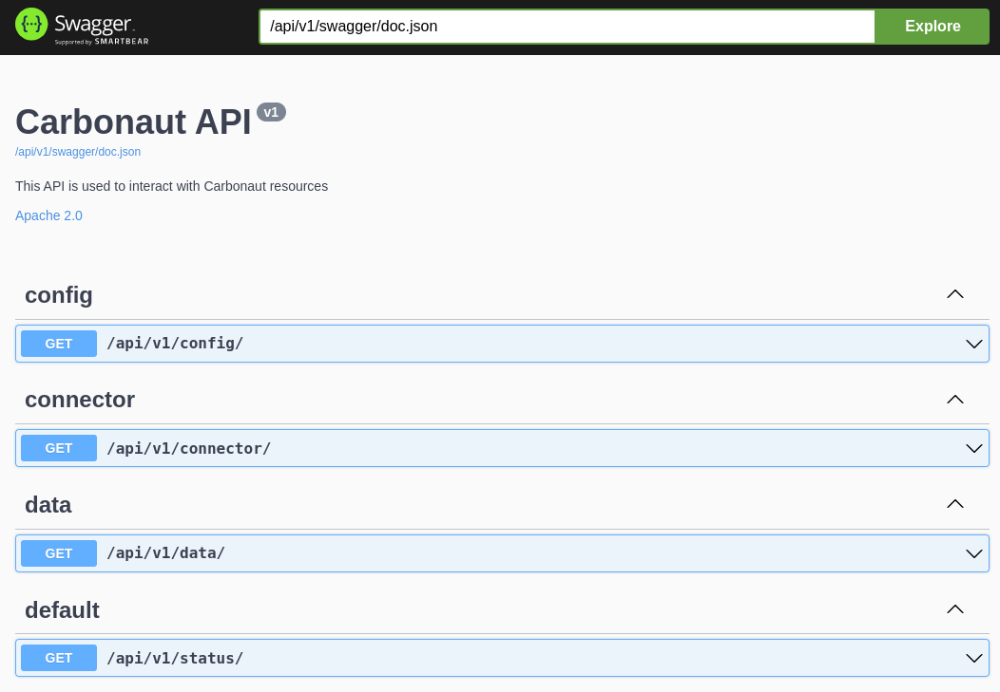

# Carbonaut API

The Carbonaut API is build using [`fiber`](https://github.com/gofiber/fiber) and the swagger extension [`fiber-swagger`](https://github.com/gofiber/swagger)

## Swagger

To rebuild the swagger definition the `make` command `make swag` can be used.
To add to the swagger overview annotations are needed like the one in the example below. The schema to define these annotations can be found on [swaggo/swag](https://github.com/swaggo/swag) documentation site.

The compiled swagger spec is stored in the `docs` folder.

```go
// ShowAccount godoc
// @Summary Show a account
// @Description get string by ID
// @ID get-string-by-int
// @Accept  json
// @Produce  json
// @Param id path int true "Account ID"
// @Success 200 {object} Account
// @Failure 400 {object} HTTPError
// @Failure 404 {object} HTTPError
// @Failure 500 {object} HTTPError
// @Router /accounts/{id} [get]
func ShowAccount(c *fiber.Ctx) error {
	return c.JSON(Account{
		Id: c.Params("id"),
	})
}

type Account struct {
	Id string
}

type HTTPError struct {
	status  string
	message string
}
```

Carbonaut API swagger dashboard:



## Schema

The carbonaut API is structure

* Base path: `api/<version>/`
* Status endpoint: `api/<version>/status`
* Swagger endpoint: `api/<version>/swagger`
* Sub endpoints to access the configuration or interact with the data stored by carbonaut `api/<version>/<data|config>/*` is used

To explore the entire structure and the available methods its recommended to explore the swagger api on a local hosted carbonaut installation.
