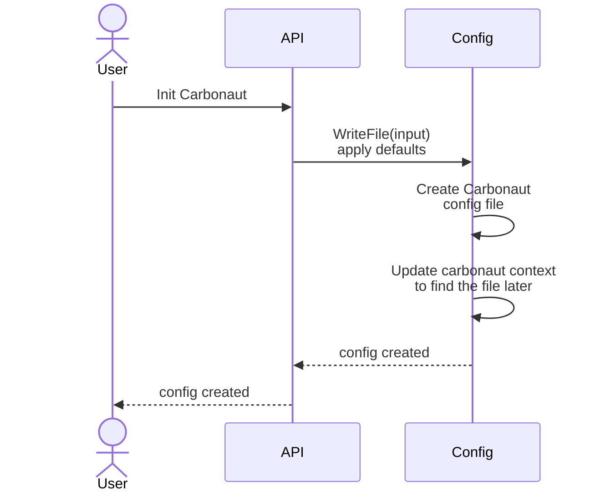
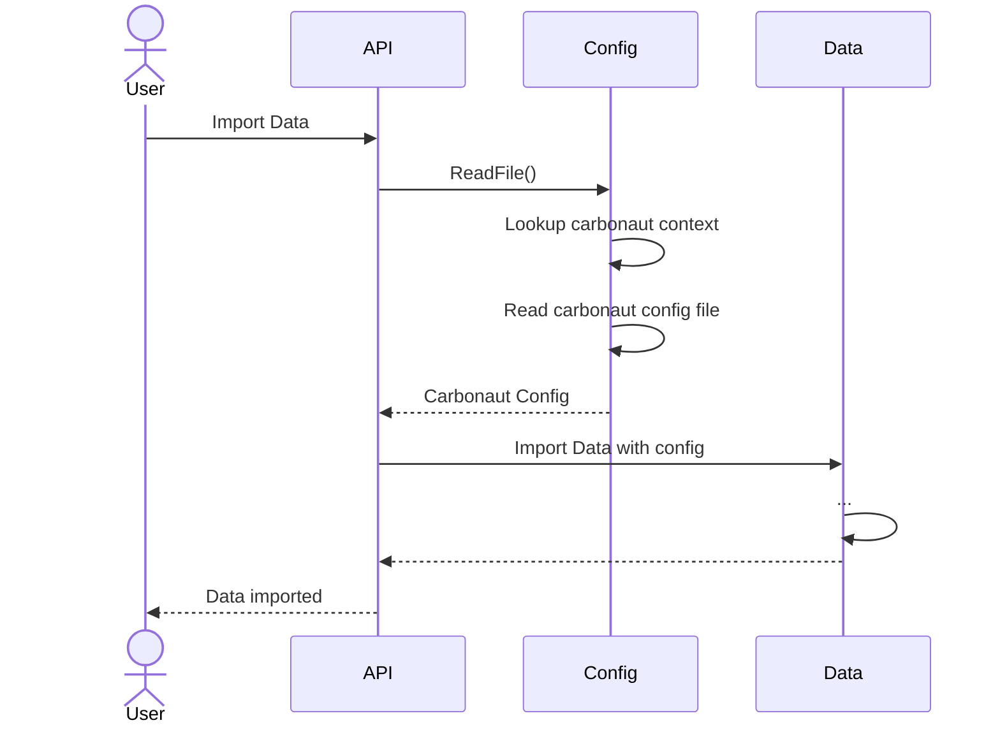

# Config PKG

The config pkg is used to manage the carbonaut configuration file. The package exposes two functions to do so `ReadFile` & `WriteFile`.
The Carbonaut configuration is stored as yaml file, in the structure of the struct `CarbonConfig`.
`WriteFile` overwrites any existing configuration.

Upon initialization this is how the runtime looks like.

Interacting with the a data provider this is how the runtime looks like.

